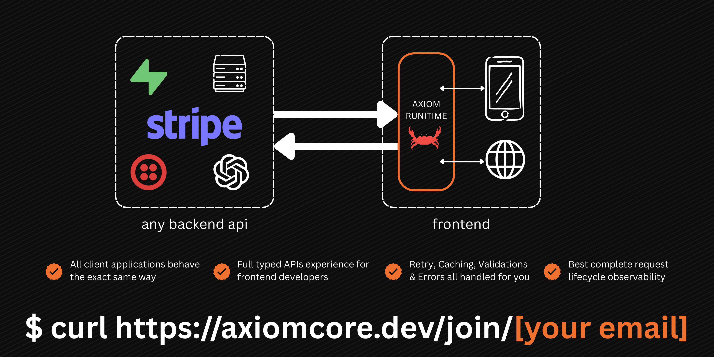

<p align="center">
  
</p>

<h1 align="center">Axiom Core</h1>

<h3 align="center">
  <strong>Deterministic API Contracts. Signed. Typed. Runtime-Enforced.</strong>
</h3>

<p align="center">
  <a href="https://discord.gg/Fvv7ufN2DK"></a>
  <a href="https://axiomcore.dev"></a>
  <a href="https://docs.axiomcore.dev"></a>
</p>

## What is Axiom Core?

Axiom Core is a **deterministic behavioral layer** for API consumption. It replaces fragile, maintenance-heavy "Fat SDKs" with a **Thin Type Layer** and a **Native Rust Runtime**. 

It exists to solve the "Non-Deterministic Gap" where backend changes break apps because of inconsistent retry logic, caching strategies, and validation rules. With Axiom, the behavior is defined once in an Acore contract and enforced natively on the client.

## 🚀 Private Alpha Phase

Axiom Core is currently in **Private Alpha**. We are validating the architecture with a select group of developers before moving to an **Open Core** model. To join, email **contact@yashmakan.com**. You will receive a response within 24 hours.

### Join the Waitlist
You can join the waitlist directly from your terminal:
```bash
curl https://axiomcore.dev/join/your-email@example.com
```

### Immediate CLI Access
If you are an engineer working on high-scale Python/Flutter apps and want to provide feedback, email **contact@yashmakan.com**. You will receive a response within 24 hours.

---

## 🛠 Quick Start

Once you have access, the Axiom workflow is designed to be frictionless:

1. **Initialize (Backend):** 
   ```bash
   axiom init
   ```
2. **Define Behavior:** Update `axiom.acore` with your caching/retry policies.
3. **Release:** 
   ```bash
   axiom build --release
   ```
4. **Pull (Frontend):** 
   ```bash
   axiom pull
   ```

Check out our **[Example Projects](./examples)** to see Axiom in action.

---

## 🗺 Roadmap & Ecosystem

We are currently operating as a "Source Available" project during Alpha, but we are committed to Open Source.

### Current Public Repositories
- [**Rod**](https://github.com/AxiomCore/rod): The Write-Once, Validate-Anywhere Schema Library.
- [**Axiom SDK (Dart)**](https://github.com/AxiomCore/axiom-sdk): The generated interface layer for Flutter.
- [**Homebrew Tap**](https://github.com/AxiomCore/homebrew-tap): Official CLI distribution.

### Upcoming Open Source Transitions (Post-Alpha)
After internal testing and PoC validation, we will be open-sourcing the following core components:
- `axiom-runtime`: The native Rust execution engine.
- `axiom-build`: The artifact compilation logic.
- `axiom-cli`: The primary developer tool.

---

## 💡 Our Ideology

Contributions from the community are our lifeblood. We believe that critical infrastructure should be:
1. **Transparent:** All architectural choices and security models will be documented and open for discussion.
2. **Deterministic:** We prioritize predictable, native execution over non-deterministic AI generation.
3. **Secure:** Every contract pull is cryptographically verified to prevent tampering.

We invite you to join our **[Discord Community](https://discord.gg/Fvv7ufN2DK)** to participate in architectural discussions and stay updated on our progress toward Open Core.

---

## 🛡 Security & Conduct

- **Security:** If you discover a vulnerability, please do not open a public issue. Email **contact@yashmakan.com** privately. See [SECURITY.md](./SECURITY.md).
- **Conduct:** We are committed to a welcoming environment. See [CODE_OF_CONDUCT.md](./CODE_OF_CONDUCT.md).

---
<p align="center">Built with 🦀 in Rust for a more stable developer experience across</p>