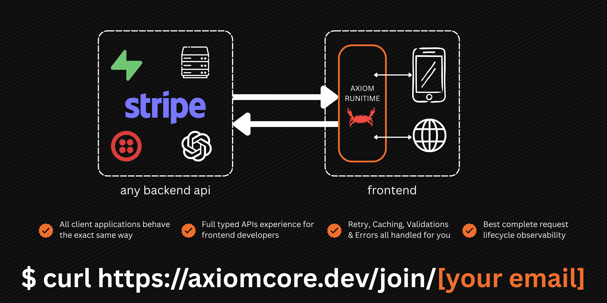

<p align="center">
  
</p>

<h1 align="center">AxiomCore</h1>

<p align="center">
  Build, connect, test, and evolve software through typed, auditable contracts.
</p>

<p align="center">
  <a href="https://axiomcore.dev">Website</a> ·
  <a href="https://docs.axiomcore.dev">Documentation</a> ·
  <a href="https://discord.gg/Fvv7ufN2DK">Community</a>
</p>

## What AxiomCore is

AxiomCore is a contract platform for software boundaries. It connects the
**Acore** authoring language, versioned `.axiom` artifacts, semantic diff,
tests and mocks, generated client integrations, native and browser runtimes,
declarative UI tooling, and a connected Cloud control plane.

Adoption is incremental. A FastAPI or Go service can remain ordinary backend
code. A Flutter, React, or HTML-first application can remain in its existing
framework. Acore can describe the contract between them and, when useful, can
also author a declarative user interface.

```text
backend source or Acore
          │
          ▼
 extract · evaluate · validate
          │
          ▼
 versioned .axiom artifact ──► inspect · diff · test · mock · release
          │
          ├──────────────────► existing framework client
          └──────────────────► Acore UI application (.axiomapp)
```

## Current availability

AxiomCore is an alpha ecosystem. Availability is attached to a specific
capability rather than inherited by the entire platform.

| Capability | Status | Current boundary |
| --- | --- | --- |
| FastAPI extraction | Available | Primary backend extraction path; module initialization executes in the build environment. |
| Go extraction | Alpha | Route and type extraction; review output for each service. |
| Contract build, inspect, diff, test, and mock | Alpha | Implemented local workflow with pre-stable artifact and CLI surfaces. |
| Vanilla web / ATMX | Available | Browser Wasm runtime and generated client path. |
| React / ATMX and Flutter / Dart | Alpha | Implemented bindings; validate application startup and release builds. |
| Swift / Apple integration | Experimental | Runtime distribution foundations without full public binding parity. |
| Acore UI and `.axiomapp` | Alpha | Browser, Android Emulator, and iOS Simulator development workflows. |
| Axiom Cloud Dashboard | Alpha | Accounts, projects, contracts, release evidence, environments, tests, reviews, and observability. |
| Axiom Studio, Acode, and Axiom Marketplace | Coming soon | Product direction only; no supported installation workflow today. |

Read the [full support matrix](./docs/content/docs/introduction/support-matrix.mdx)
before selecting a production integration path.

## Start locally

Install the Axiom CLI using the
[current installation guide](./docs/content/docs/getting-started/installation.mdx),
then inspect the repository before changing it:

```bash
axiom doctor
axiom onboard
```

For a FastAPI service:

```bash
axiom install axiom-fastapi --module
axiom init ./main.py:app --module axiom-fastapi
axiom build axiom.acore
axiom inspect axiom.axiom
axiom test axiom.acore
```

FastAPI extraction imports the selected application module. Install its
dependencies and keep import-time initialization safe for a build environment.

For an existing frontend:

```bash
axiom pull --contract ../backend/axiom.axiom --framework atmx-web
```

Current framework paths and startup requirements are documented under
[Client integration](./docs/content/docs/clients/index.mdx).

## Release through Axiom Cloud

Connected workflows require an account, project membership, and a reachable
control plane:

```bash
axiom login
axiom project link
axiom build --release --version 1.2.0
```

A Cloud release stores immutable artifact bytes, signs their digest, and
retains pipeline evidence. Release upload is not equivalent to deploying an
arbitrary backend or mobile application. See
[Releases and environments](./docs/content/docs/cloud/releases-and-environments.mdx).

## Repository map

| Path | Responsibility |
| --- | --- |
| `cli/` | Public `axiom` command-line interface |
| `docs/` | Next.js/Fumadocs documentation application and editorial evidence |
| `examples/` | Contract and integration fixtures documented by `examples/README.md` |
| `packages/atmx-cli/` | Public `atmx-cli` npm package source |
| `artifacts/legacy/` | Historical checked-in build artifacts; current downloadable assets are attached to this repository's GitHub Releases |

The surrounding AxiomCore workspace contains independent repositories for the
Acore language, artifact libraries, runtime, extractors, SDKs, UI compiler and
host, Cloud backend, and dashboard. Their APIs have different maturity
boundaries; the documentation evidence ledger names the owning implementation
for public claims.

## Documentation and examples

- [Documentation home](./docs/content/docs/index.mdx)
- [Acore language manual](./docs/content/docs/acore-language/index.mdx)
- [Workflows](./docs/content/docs/workflows/index.mdx)
- [Guides](./docs/content/docs/guides/index.mdx)
- [CLI reference](./docs/content/docs/tooling/cli-reference.mdx)
- [Troubleshooting](./docs/content/docs/reference/troubleshooting.mdx)
- [Versioning and deprecation](./docs/content/docs/reference/versioning-and-deprecation.mdx)
- [Support and feedback](./docs/content/docs/reference/support-and-feedback.mdx)
- [Example catalog](./examples/README.md)
- Release orchestration and operator instructions live in the private sibling repository `AxiomCore/Axiom-release-plane`.

Documentation claims follow
[`docs/DOCUMENTATION_CONTRACT.md`](./docs/DOCUMENTATION_CONTRACT.md) and are
anchored to implementation evidence in
[`docs/CONTENT_EVIDENCE.md`](./docs/CONTENT_EVIDENCE.md).

## Contributing and security

Run the owning repository's tests and the documentation gates appropriate to
your change. Documentation contributors can use:

```bash
cd docs
pnpm install --frozen-lockfile
pnpm check
```

Report security vulnerabilities privately using [SECURITY.md](./SECURITY.md).
Do not include credentials, signing keys, telemetry DSNs, sandbox keys,
private contract URLs, or sensitive payloads in public issues.
